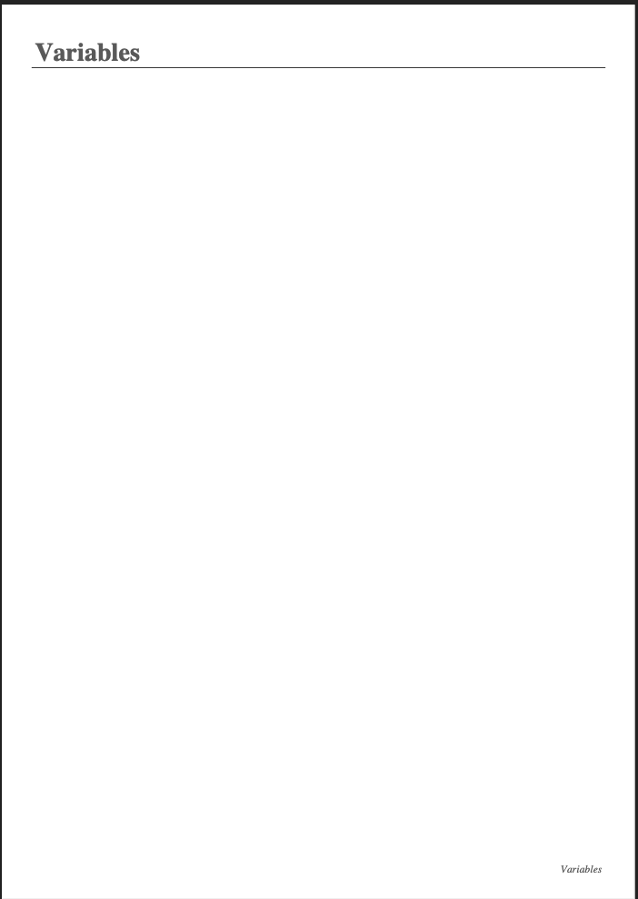
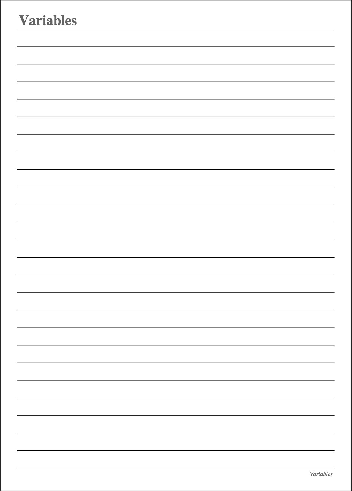

# PDF Generator

 

## <u>Table of Contents</u>

1. [Description](#Description)
2. [Installation](#Installation)
3. [Usage](#Usage)
4. [Contributing](#Contributing)
5. [Authors](#Authors)
6. [License](#License)

## Description

PDF Generator is a CLI application which allows users to create pdf files, which can be single or multi-paged. The
script reads instructions from a csv files, which contains information regarding topics and the number of pages for each
topic. Then the script generates a pdf file with the corresponding topics and pages created. More on how to fully
utilize this tool is below in the usage section.

### Dependencies

This application uses two third party applications when writing the script.

#### fpdf

This library is used for PDF document generation under Python. It is a simple, small and versatile package, with
advnaced capabilities and easy to learn, extend and maintain. To learn more about this package, click the following
link: [fdpf](https://pypi.org/project/fpdf/)

#### pandas

pandas is an easy-to-use package which allows for fast, flexible and expressive data structures designed to make working
with data both easy and intuitive. For this application, it is used to read csv files, which are the instructions for
the pdf generation. For more information on this package, visit the following
link: [pandas](https://pypi.org/project/pandas/)

## Installation

To install this application to your local machine, clone the source code using the following command in your terminal:

```commandline
git clone https://github.com/Charanvir/PDF-Generator-.git
```

This will create a project directory on your local machine which contains the source code for this application.
To run this project, the user must have Python3 installed on their local machine.

## Usage

This project contains two script files. main.py contains the script with which a pdf file is generated, which is blank.
Lined-PDF.py contains the script which generates a pdf file that is lined.

To run the main.py script, navigate to the root directory of the project in your terminal. Then run the following
command.

```commandline
python3 main.py
```

To run the Lined-PDF.py script, navigate to the root directory of the project in your terminal. Then run the following
command.

```commandline
python3 Lined-PDF.py
```

Both scripts will generate PDF files which follow the overall instructions of the .csv file contained in the root
directory, called topics.csv. To customize your PDF that are generated, this file can be modified to your liking. Add
your custom topics under the Topic column, and the number of pages you wish for each topic to have in the Pages column.
The script will read these changes and generate a single-paged or multi-paged PDF file depending on your instructions.
The main.py script generates a file which is named output.pdf and is created in the root directory. The Lined-PDF.py
script generates a file called lined-pdf.pdf and is also created in the root directory. The names for these files can be
manually changed after they are created, or can be changed in the script itself.

For main.py, to change the name of the output pdf, navigate to line 30 on your IDE or code editor and change the
output.pdf string to whatever you wish the name of the file to be. A similar change can be made in the Lined-PDF.py file
on line 35.

#### Example of a blank pdf generated:



#### Example of a lined pdf generated:



## Contributing

We are always looking to improve your application and code, so if you wish to contribute, please create a repository and
push all changes you make to it. Then email me at charanvir123@gmail.com, and I will try to get back to you after I have
reviewed the code.

## Authors

To view more projects visit my [GitHub](https://github.com/Charanvir) account.

Direct any additional questions you have regarding this application to charanvir123@gmail.com

# License

The following application is covered under the MIT License.